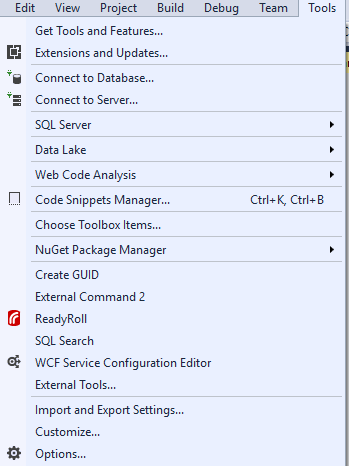
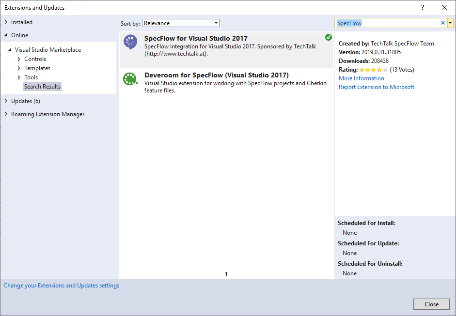
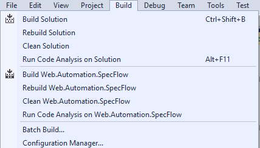
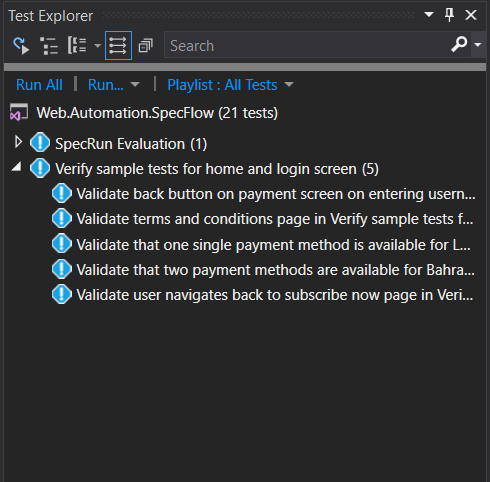

<!-- PROJECT SHIELDS -->

       
  
  
  

  
    
  

     
    <a href="#instructions"><strong>| Read Instructions |</strong></a>
    <a href="#project-structure"><strong> Project Structure |</strong></a>
    <a href="https://github.com/mahmoudazaid/Integral/tree/master/TestResults"><strong>Test Results |</strong></a>    
         
  

## Instructions
1. <strong>Visual studio installed</strong>
2. <strong> Clone the project to your machine</strong>
3. <strong> Make sure SpecFlow installed in Visual Studio: Under Tools > Extenstions and Update</strong>

4. <strong>Build the Solution</strong>

5. <strong>From test Explorer choose your test case to run</strong>

6. <strong>Make Sure you downloded the Chrome version `75.0.3770.100` </strong>
7. <strong>Make sure you were downloded Microsoft Expression Encoder 4 from <a href="https://www.microsoft.com/en-sa/download/details.aspx?id=18974">here</a>
 </strong>
 8. <strong>Make Sure to run the recorded videos from selenium by VLC application</strong>

## Project Structure 
1. <strong>BLL Project: Contains The selenium logic</strong>
    * <strong>Browser:</strong> Contains driver class to open the browser
    * <strong>Extensions:</strong> Contains the classes that responsoble for actions
        * DriverExtensions.cs: responsible for handel browser actions like scrolling and alerts
        * ElementExtensions.cs: responsible for element inspections and waiting
        * JSExtensions.cs: contians method that take a java script and runnig it
        * SEActions.cs: resonsible for selenium actions such as (Click, SendKeys)
    * <strong>Utlities:</strong> contains helper classes
        * FileManager.cs: responsible for acting with system directories like (Check file downoaded, Delete file from the system, create directory)
        * ScreenShot.cs: responsible for taking screenshot from the system
        * VideoRecorder.cs: responsible for recording video
    * <strong>WebElementParser</strong>: responsible reading the elements locatores from JSON file
        * ParserManager.cs: read all JSONs parsed from the step defention class
        * ElementParser.cs: read the elements from JSON and deserlize it
        * LocatorFactory: read the loctor from the JSON based on type such as (XPath)
        * LoctorTypes.cs: contains all locator types.
        * WebElement.cs: contains the JSON elements to use it in deserlization
   
2. <strong>Web.Automation.SpecFlow Project: Contains the all features file and step defentions</strong>
    * <strong>Features:</strong> Contains all BDD test cases
    * <strong>StepDefinitions:</strong> Contains all code behind test cases
    * <strong>ObjectRepository:</strong> Contains the JSON files that contain the elements locators 
    * <strong>Reports:</strong> Contains the report template
    * <strong>Hooks.cs:</strong> The class responsible for setup and teardown 
    
## Note:
There is 2 Featre files has been created one for English and the other one for Arabic, but one feature file is enough only what you need is change the tag between `@EN` and `@AR`
